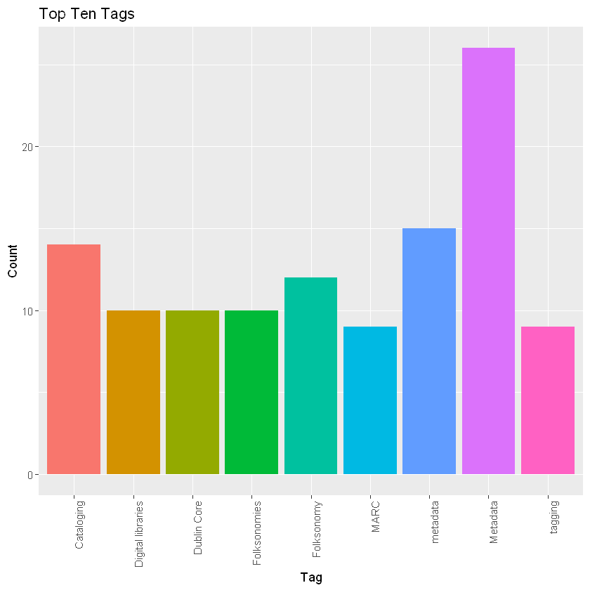

This script extracts the tags from a Zotero library export, counts how often each tag is used in the library, then exports the results to a CSV file.

To export the citation data from Zotero, right-click the library in the Zotero desktop application and select _Export Library_.  Use the CSV format.

The script code is posted [in a GitHub gist](https://gist.github.com/jered0/a2881b422f813d725e4fcccb0013ac92).  That code won't have all the `head()` commands in it that show what the data looks like at each step (by printing the first few lines of data).

---

The script starts by loading a library it uses, then it imports the data using the `read.csv()` function.


```R
library(tidyverse)

zexport <- read.csv("LIS5703_sp19_burnett.csv", header = TRUE)
head(zexport)
```


<table>
<thead><tr><th scope=col>ï..Key</th><th scope=col>Item.Type</th><th scope=col>Publication.Year</th><th scope=col>Author</th><th scope=col>Title</th><th scope=col>Publication.Title</th><th scope=col>ISBN</th><th scope=col>ISSN</th><th scope=col>DOI</th><th scope=col>Url</th><th scope=col>...</th><th scope=col>Programming.Language</th><th scope=col>Version</th><th scope=col>System</th><th scope=col>Code</th><th scope=col>Code.Number</th><th scope=col>Section</th><th scope=col>Session</th><th scope=col>Committee</th><th scope=col>History</th><th scope=col>Legislative.Body</th></tr></thead>
<tbody>
	<tr><td>WS9986IF                                                                                                                                                                                   </td><td>bookSection                                                                                                                                                                                </td><td>2013                                                                                                                                                                                       </td><td>                                                                                                                                                                                           </td><td>Resource description and metadata. Ch. 4                                                                                                                                                   </td><td>The Discipline of Organizing.                                                                                                                                                              </td><td>                                                                                                                                                                                           </td><td>                                                                                                                                                                                           </td><td>                                                                                                                                                                                           </td><td>http://disciplineoforganizing.org/tdo-v-1-2013/                                                                                                                                            </td><td>...                                                                                                                                                                                        </td><td>NA                                                                                                                                                                                         </td><td>NA                                                                                                                                                                                         </td><td>NA                                                                                                                                                                                         </td><td>NA                                                                                                                                                                                         </td><td>NA                                                                                                                                                                                         </td><td>NA                                                                                                                                                                                         </td><td>NA                                                                                                                                                                                         </td><td>NA                                                                                                                                                                                         </td><td>NA                                                                                                                                                                                         </td><td>NA                                                                                                                                                                                         </td></tr>
	<tr><td>9DRSU9XX                                                                                                                                                                                               </td><td>journalArticle                                                                                                                                                                                         </td><td>2013                                                                                                                                                                                                   </td><td><span style=white-space:pre-wrap>Fee, William                                                         </span>                                                                                          </td><td><span style=white-space:pre-wrap>Where Is the Justice… League?: Graphic Novel Cataloging and Classification                                               </span>                                    </td><td><span style=white-space:pre-wrap>Serials Review                       </span>                                                                                                                          </td><td><span style=white-space:pre-wrap>                                                                                                                                                          </span>     </td><td><span style=white-space:pre-wrap>0098-7913           </span>                                                                                                                                           </td><td>10.1016/j.serrev.2013.02.004                                                                                                                                                                           </td><td>http://eds.b.ebscohost.com.proxy.lib.fsu.edu/eds/detail/detail?vid=3&amp;sid=359fa31d-2e3b-46eb-97c8-156d83153122%40pdc-v-sessmgr01&amp;bdata=JnNpdGU9ZWRzLWxpdmU%3d#AN=S009879131300018X&amp;db=edselp</td><td>...                                                                                                                                                                                                    </td><td>NA                                                                                                                                                                                                     </td><td>NA                                                                                                                                                                                                     </td><td>NA                                                                                                                                                                                                     </td><td>NA                                                                                                                                                                                                     </td><td>NA                                                                                                                                                                                                     </td><td>NA                                                                                                                                                                                                     </td><td>NA                                                                                                                                                                                                     </td><td>NA                                                                                                                                                                                                     </td><td>NA                                                                                                                                                                                                     </td><td>NA                                                                                                                                                                                                     </td></tr>
	<tr><td>UW2VNDKM                                                                                                                                                                                   </td><td>journalArticle                                                                                                                                                                             </td><td>2004                                                                                                                                                                                       </td><td>Guenther, Rebecca S.                                                                                                                                                                       </td><td>Using the Metadata Object Description Schema (MODS) for resource description: guidelines and applications                                                                                  </td><td>Library Hi Tech                                                                                                                                                                            </td><td>                                                                                                                                                                                           </td><td>0737-8831                                                                                                                                                                                  </td><td>10.1108/07378830410524530                                                                                                                                                                  </td><td>https://www-emeraldinsight-com.proxy.lib.fsu.edu/doi/full/10.1108/07378830410524530                                                                                                        </td><td>...                                                                                                                                                                                        </td><td>NA                                                                                                                                                                                         </td><td>NA                                                                                                                                                                                         </td><td>NA                                                                                                                                                                                         </td><td>NA                                                                                                                                                                                         </td><td>NA                                                                                                                                                                                         </td><td>NA                                                                                                                                                                                         </td><td>NA                                                                                                                                                                                         </td><td>NA                                                                                                                                                                                         </td><td>NA                                                                                                                                                                                         </td><td>NA                                                                                                                                                                                         </td></tr>
	<tr><td>SA8GBJ6F                                                                                                                                                                                   </td><td>journalArticle                                                                                                                                                                             </td><td>2014                                                                                                                                                                                       </td><td>Gherardelli, Monica; Adembri, Giulia; Balleri, Rita; Di Tondo, Sergio                                                                                                                      </td><td>Methods and tools for the classification and cataloging of antique moulds from the collection of the Richard-Ginori factory                                                                </td><td>Journal of Cultural Heritage                                                                                                                                                               </td><td>                                                                                                                                                                                           </td><td>12962074                                                                                                                                                                                   </td><td>10.1016/j.culher.2013.11.001                                                                                                                                                               </td><td>https://linkinghub.elsevier.com/retrieve/pii/S1296207413002100                                                                                                                             </td><td>...                                                                                                                                                                                        </td><td>NA                                                                                                                                                                                         </td><td>NA                                                                                                                                                                                         </td><td>NA                                                                                                                                                                                         </td><td>NA                                                                                                                                                                                         </td><td>NA                                                                                                                                                                                         </td><td>NA                                                                                                                                                                                         </td><td>NA                                                                                                                                                                                         </td><td>NA                                                                                                                                                                                         </td><td>NA                                                                                                                                                                                         </td><td>NA                                                                                                                                                                                         </td></tr>
	<tr><td>PUNVLD44                                                                                                                                                                                                                                       </td><td><span style=white-space:pre-wrap>book          </span>                                                                                                                                                                                         </td><td>2008                                                                                                                                                                                                                                           </td><td><span style=white-space:pre-wrap>Maxwell, Robert L.                                                   </span>                                                                                                                                  </td><td><span style=white-space:pre-wrap>FRBR: A Guide for the Perplexed                                                                                            </span>                                                                            </td><td><span style=white-space:pre-wrap>                                     </span>                                                                                                                                                                  </td><td>9780838909508 (alk. paper) 0838909507 (alk. paper) 9780838909508 (pbk.) 0838909507 (pbk.) 0838909507 (pbk. : alk. paper) 9780838909508 (pbk. : alk. paper)                                                                                     </td><td><span style=white-space:pre-wrap>                    </span>                                                                                                                                                                                   </td><td><span style=white-space:pre-wrap>                             </span>                                                                                                                                                                          </td><td><span style=white-space:pre-wrap>http://eds.b.ebscohost.com.proxy.lib.fsu.edu/eds/detail/detail?vid=1&amp;sid=1326756d-e7d3-4691-ae50-094f92e3b434%40sessionmgr102&amp;bdata=JnNpdGU9ZWRzLWxpdmU%3d#AN=fsu.020174214&amp;db=cat05720a   </span></td><td>...                                                                                                                                                                                                                                            </td><td>NA                                                                                                                                                                                                                                             </td><td>NA                                                                                                                                                                                                                                             </td><td>NA                                                                                                                                                                                                                                             </td><td>NA                                                                                                                                                                                                                                             </td><td>NA                                                                                                                                                                                                                                             </td><td>NA                                                                                                                                                                                                                                             </td><td>NA                                                                                                                                                                                                                                             </td><td>NA                                                                                                                                                                                                                                             </td><td>NA                                                                                                                                                                                                                                             </td><td>NA                                                                                                                                                                                                                                             </td></tr>
	<tr><td>YCRGBSDB                                                                                                                                                                                                                           </td><td>journalArticle                                                                                                                                                                                                                     </td><td>2018                                                                                                                                                                                                                               </td><td><span style=white-space:pre-wrap>Ward, Mark; Saarti, Jarmo                                            </span>                                                                                                                      </td><td><span style=white-space:pre-wrap>Reviewing, Rebutting, and Reimagining Fiction Classification                                                               </span>                                                                </td><td>Cataloging &amp; Classification Quarterly                                                                                                                                                                                          </td><td><span style=white-space:pre-wrap>                                                                                                                                                          </span>                                 </td><td>0163-9374, 1544-4554                                                                                                                                                                                                               </td><td>10.1080/01639374.2017.1411414                                                                                                                                                                                                      </td><td><span style=white-space:pre-wrap>https://www.tandfonline.com/doi/full/10.1080/01639374.2017.1411414                                                                                                                         </span></td><td>...                                                                                                                                                                                                                                </td><td>NA                                                                                                                                                                                                                                 </td><td>NA                                                                                                                                                                                                                                 </td><td>NA                                                                                                                                                                                                                                 </td><td>NA                                                                                                                                                                                                                                 </td><td>NA                                                                                                                                                                                                                                 </td><td>NA                                                                                                                                                                                                                                 </td><td>NA                                                                                                                                                                                                                                 </td><td>NA                                                                                                                                                                                                                                 </td><td>NA                                                                                                                                                                                                                                 </td><td>NA                                                                                                                                                                                                                                 </td></tr>
</tbody>
</table>


At this point there are duplicates in the data because of a syncing error.  We can see that when we sort by title.


```R
head(zexport[order(zexport$Title),])
```


<table>
<thead><tr><th></th><th scope=col>ï..Key</th><th scope=col>Item.Type</th><th scope=col>Publication.Year</th><th scope=col>Author</th><th scope=col>Title</th><th scope=col>Publication.Title</th><th scope=col>ISBN</th><th scope=col>ISSN</th><th scope=col>DOI</th><th scope=col>Url</th><th scope=col>...</th><th scope=col>Programming.Language</th><th scope=col>Version</th><th scope=col>System</th><th scope=col>Code</th><th scope=col>Code.Number</th><th scope=col>Section</th><th scope=col>Session</th><th scope=col>Committee</th><th scope=col>History</th><th scope=col>Legislative.Body</th></tr></thead>
<tbody>
	<tr><th scope=row>88</th><td>GSKR6E9G                                                                                                                                                                                          </td><td>journalArticle                                                                                                                                                                                    </td><td>2015                                                                                                                                                                                              </td><td><span style=white-space:pre-wrap>Steiner, Elisabeth, Koch, Carina    </span>                                                                                                                      </td><td><span style=white-space:pre-wrap>"A Digital Archive of Cultural Heritage Objects: Standardized Metadata and Annotation Categories"                                                         </span></td><td><span style=white-space:pre-wrap>New Review of Information Networking     </span>                                                                                                                 </td><td>                                                                                                                                                                                                  </td><td><span style=white-space:pre-wrap>         </span>                                                                                                                                                 </td><td><span style=white-space:pre-wrap>                         </span>                                                                                                                                 </td><td>https://login.proxy.lib.fsu.edu/login?url=http://search.ebscohost.com/login.aspx?direct=true&amp;db=edb&amp;AN=111800033&amp;site=eds-live                                                        </td><td>...                                                                                                                                                                                               </td><td>NA                                                                                                                                                                                                </td><td>NA                                                                                                                                                                                                </td><td>NA                                                                                                                                                                                                </td><td>NA                                                                                                                                                                                                </td><td>NA                                                                                                                                                                                                </td><td>NA                                                                                                                                                                                                </td><td>NA                                                                                                                                                                                                </td><td>NA                                                                                                                                                                                                </td><td>NA                                                                                                                                                                                                </td><td>NA                                                                                                                                                                                                </td></tr>
	<tr><th scope=row>227</th><td>5ID7TV7Q                                                                                                                                                                                          </td><td>journalArticle                                                                                                                                                                                    </td><td>2015                                                                                                                                                                                              </td><td><span style=white-space:pre-wrap>Steiner, Elisabeth, Koch, Carina    </span>                                                                                                                      </td><td><span style=white-space:pre-wrap>"A Digital Archive of Cultural Heritage Objects: Standardized Metadata and Annotation Categories"                                                         </span></td><td><span style=white-space:pre-wrap>New Review of Information Networking     </span>                                                                                                                 </td><td>                                                                                                                                                                                                  </td><td><span style=white-space:pre-wrap>         </span>                                                                                                                                                 </td><td><span style=white-space:pre-wrap>                         </span>                                                                                                                                 </td><td>https://login.proxy.lib.fsu.edu/login?url=http://search.ebscohost.com/login.aspx?direct=true&amp;db=edb&amp;AN=111800033&amp;site=eds-live                                                        </td><td>...                                                                                                                                                                                               </td><td>NA                                                                                                                                                                                                </td><td>NA                                                                                                                                                                                                </td><td>NA                                                                                                                                                                                                </td><td>NA                                                                                                                                                                                                </td><td>NA                                                                                                                                                                                                </td><td>NA                                                                                                                                                                                                </td><td>NA                                                                                                                                                                                                </td><td>NA                                                                                                                                                                                                </td><td>NA                                                                                                                                                                                                </td><td>NA                                                                                                                                                                                                </td></tr>
	<tr><th scope=row>228</th><td>Z4PI77HA                                                                                                                                                                                          </td><td>journalArticle                                                                                                                                                                                    </td><td>2015                                                                                                                                                                                              </td><td><span style=white-space:pre-wrap>Steiner, Elisabeth, Koch, Carina    </span>                                                                                                                      </td><td><span style=white-space:pre-wrap>"A Digital Archive of Cultural Heritage Objects: Standardized Metadata and Annotation Categories"                                                         </span></td><td><span style=white-space:pre-wrap>New Review of Information Networking     </span>                                                                                                                 </td><td>                                                                                                                                                                                                  </td><td><span style=white-space:pre-wrap>         </span>                                                                                                                                                 </td><td><span style=white-space:pre-wrap>                         </span>                                                                                                                                 </td><td>https://login.proxy.lib.fsu.edu/login?url=http://search.ebscohost.com/login.aspx?direct=true&amp;db=edb&amp;AN=111800033&amp;site=eds-live                                                        </td><td>...                                                                                                                                                                                               </td><td>NA                                                                                                                                                                                                </td><td>NA                                                                                                                                                                                                </td><td>NA                                                                                                                                                                                                </td><td>NA                                                                                                                                                                                                </td><td>NA                                                                                                                                                                                                </td><td>NA                                                                                                                                                                                                </td><td>NA                                                                                                                                                                                                </td><td>NA                                                                                                                                                                                                </td><td>NA                                                                                                                                                                                                </td><td>NA                                                                                                                                                                                                </td></tr>
	<tr><th scope=row>518</th><td>GF4KP98B                                                                                                                                                                                          </td><td>journalArticle                                                                                                                                                                                    </td><td>2016                                                                                                                                                                                              </td><td><span style=white-space:pre-wrap>Kiu, Ching Chieh                    </span>                                                                                                                      </td><td><span style=white-space:pre-wrap>"Automatic Tags Generation in Folksonomy for Learning Resources Reuse and Sharing"                                                                        </span></td><td>Pertanika Journal of Science &amp; Technology                                                                                                                                                     </td><td>                                                                                                                                                                                                  </td><td><span style=white-space:pre-wrap>         </span>                                                                                                                                                 </td><td><span style=white-space:pre-wrap>                         </span>                                                                                                                                 </td><td><span style=white-space:pre-wrap>                                                                                                                              </span>                            </td><td>...                                                                                                                                                                                               </td><td>NA                                                                                                                                                                                                </td><td>NA                                                                                                                                                                                                </td><td>NA                                                                                                                                                                                                </td><td>NA                                                                                                                                                                                                </td><td>NA                                                                                                                                                                                                </td><td>NA                                                                                                                                                                                                </td><td>NA                                                                                                                                                                                                </td><td>NA                                                                                                                                                                                                </td><td>NA                                                                                                                                                                                                </td><td>NA                                                                                                                                                                                                </td></tr>
	<tr><th scope=row>131</th><td>BVP3WQ2D                                                                                                                                                                                          </td><td>journalArticle                                                                                                                                                                                    </td><td>2015                                                                                                                                                                                              </td><td><span style=white-space:pre-wrap>MYNTTI, J. jeremy, NEATROUR, A      </span>                                                                                                                      </td><td><span style=white-space:pre-wrap>"Use Existing Data First: Reconcile Metadata before Creating New Controlled Vocabularies"                                                                 </span></td><td><span style=white-space:pre-wrap>Journal of Library Metadata              </span>                                                                                                                 </td><td>                                                                                                                                                                                                  </td><td><span style=white-space:pre-wrap>         </span>                                                                                                                                                 </td><td><span style=white-space:pre-wrap>                         </span>                                                                                                                                 </td><td><span style=white-space:pre-wrap>http://search.ebscohost.com.proxy.lib.fsu.edu/login.aspx?direct=true&amp;db=eue&amp;AN=112288279&amp;site=eds-live&amp;scope=site             </span>            </td><td>...                                                                                                                                                                                               </td><td>NA                                                                                                                                                                                                </td><td>NA                                                                                                                                                                                                </td><td>NA                                                                                                                                                                                                </td><td>NA                                                                                                                                                                                                </td><td>NA                                                                                                                                                                                                </td><td>NA                                                                                                                                                                                                </td><td>NA                                                                                                                                                                                                </td><td>NA                                                                                                                                                                                                </td><td>NA                                                                                                                                                                                                </td><td>NA                                                                                                                                                                                                </td></tr>
	<tr><th scope=row>67</th><td>DRV8JWSJ                                                                                                                                                  </td><td>journalArticle                                                                                                                                            </td><td>2012                                                                                                                                                      </td><td>Taheri, Sayyed Mahdi; Hariri, Nadjla                                                                                                                      </td><td>A comparative study on the indexing and ranking of the content objects including the MARCXML and Dublin Core's metadata elements by general search engines</td><td>The Electronic Library                                                                                                                                    </td><td>                                                                                                                                                          </td><td>0264-0473                                                                                                                                                 </td><td>10.1108/02640471211252193                                                                                                                                 </td><td>https://www-emeraldinsight-com.proxy.lib.fsu.edu/doi/pdfplus/10.1108/02640471211252193                                                                    </td><td>...                                                                                                                                                       </td><td>NA                                                                                                                                                        </td><td>NA                                                                                                                                                        </td><td>NA                                                                                                                                                        </td><td>NA                                                                                                                                                        </td><td>NA                                                                                                                                                        </td><td>NA                                                                                                                                                        </td><td>NA                                                                                                                                                        </td><td>NA                                                                                                                                                        </td><td>NA                                                                                                                                                        </td><td>NA                                                                                                                                                        </td></tr>
</tbody>
</table>


To fix that, the script sorts the data by date modified (so the most recent entry will be kept when there's a duplicate).  The `!` is a negation, so `!duplicated` in the next line selects the rows that aren't duplicates and puts them in `ztrimmed`.  It uses the author, title, and manual tags columns to determine duplicates (using the tags column ensures that if two students posted the same article, the extra entry won't be deleted).  The result eliminates the duplicates we saw when we sorted by title.


```R
zsorted <- zexport[order(zexport$Date.Modified, decreasing = TRUE),]
ztrimmed <- zsorted[!duplicated(zsorted[,c("Author", "Title", "Manual.Tags")]),]
head(ztrimmed[order(ztrimmed$Title),])
```


<table>
<thead><tr><th></th><th scope=col>ï..Key</th><th scope=col>Item.Type</th><th scope=col>Publication.Year</th><th scope=col>Author</th><th scope=col>Title</th><th scope=col>Publication.Title</th><th scope=col>ISBN</th><th scope=col>ISSN</th><th scope=col>DOI</th><th scope=col>Url</th><th scope=col>...</th><th scope=col>Programming.Language</th><th scope=col>Version</th><th scope=col>System</th><th scope=col>Code</th><th scope=col>Code.Number</th><th scope=col>Section</th><th scope=col>Session</th><th scope=col>Committee</th><th scope=col>History</th><th scope=col>Legislative.Body</th></tr></thead>
<tbody>
	<tr><th scope=row>227</th><td>5ID7TV7Q                                                                                                                                                                                          </td><td>journalArticle                                                                                                                                                                                    </td><td>2015                                                                                                                                                                                              </td><td><span style=white-space:pre-wrap>Steiner, Elisabeth, Koch, Carina                             </span>                                                                                             </td><td><span style=white-space:pre-wrap>"A Digital Archive of Cultural Heritage Objects: Standardized Metadata and Annotation Categories"                                                         </span></td><td><span style=white-space:pre-wrap>New Review of Information Networking                           </span>                                                                                           </td><td>                                                                                                                                                                                                  </td><td><span style=white-space:pre-wrap>         </span>                                                                                                                                                 </td><td><span style=white-space:pre-wrap>                            </span>                                                                                                                              </td><td><span style=white-space:pre-wrap>https://login.proxy.lib.fsu.edu/login?url=http://search.ebscohost.com/login.aspx?direct=true&amp;db=edb&amp;AN=111800033&amp;site=eds-live      </span>          </td><td>...                                                                                                                                                                                               </td><td>NA                                                                                                                                                                                                </td><td>NA                                                                                                                                                                                                </td><td>NA                                                                                                                                                                                                </td><td>NA                                                                                                                                                                                                </td><td>NA                                                                                                                                                                                                </td><td>NA                                                                                                                                                                                                </td><td>NA                                                                                                                                                                                                </td><td>NA                                                                                                                                                                                                </td><td>NA                                                                                                                                                                                                </td><td>NA                                                                                                                                                                                                </td></tr>
	<tr><th scope=row>518</th><td>GF4KP98B                                                                                                                                                                                          </td><td>journalArticle                                                                                                                                                                                    </td><td>2016                                                                                                                                                                                              </td><td><span style=white-space:pre-wrap>Kiu, Ching Chieh                                             </span>                                                                                             </td><td><span style=white-space:pre-wrap>"Automatic Tags Generation in Folksonomy for Learning Resources Reuse and Sharing"                                                                        </span></td><td><span style=white-space:pre-wrap>Pertanika Journal of Science &amp; Technology                      </span>                                                                                       </td><td>                                                                                                                                                                                                  </td><td><span style=white-space:pre-wrap>         </span>                                                                                                                                                 </td><td><span style=white-space:pre-wrap>                            </span>                                                                                                                              </td><td><span style=white-space:pre-wrap>                                                                                                                                    </span>                      </td><td>...                                                                                                                                                                                               </td><td>NA                                                                                                                                                                                                </td><td>NA                                                                                                                                                                                                </td><td>NA                                                                                                                                                                                                </td><td>NA                                                                                                                                                                                                </td><td>NA                                                                                                                                                                                                </td><td>NA                                                                                                                                                                                                </td><td>NA                                                                                                                                                                                                </td><td>NA                                                                                                                                                                                                </td><td>NA                                                                                                                                                                                                </td><td>NA                                                                                                                                                                                                </td></tr>
	<tr><th scope=row>131</th><td>BVP3WQ2D                                                                                                                                                                                          </td><td>journalArticle                                                                                                                                                                                    </td><td>2015                                                                                                                                                                                              </td><td><span style=white-space:pre-wrap>MYNTTI, J. jeremy, NEATROUR, A                               </span>                                                                                             </td><td><span style=white-space:pre-wrap>"Use Existing Data First: Reconcile Metadata before Creating New Controlled Vocabularies"                                                                 </span></td><td><span style=white-space:pre-wrap>Journal of Library Metadata                                    </span>                                                                                           </td><td>                                                                                                                                                                                                  </td><td><span style=white-space:pre-wrap>         </span>                                                                                                                                                 </td><td><span style=white-space:pre-wrap>                            </span>                                                                                                                              </td><td><span style=white-space:pre-wrap>http://search.ebscohost.com.proxy.lib.fsu.edu/login.aspx?direct=true&amp;db=eue&amp;AN=112288279&amp;site=eds-live&amp;scope=site                   </span>      </td><td>...                                                                                                                                                                                               </td><td>NA                                                                                                                                                                                                </td><td>NA                                                                                                                                                                                                </td><td>NA                                                                                                                                                                                                </td><td>NA                                                                                                                                                                                                </td><td>NA                                                                                                                                                                                                </td><td>NA                                                                                                                                                                                                </td><td>NA                                                                                                                                                                                                </td><td>NA                                                                                                                                                                                                </td><td>NA                                                                                                                                                                                                </td><td>NA                                                                                                                                                                                                </td></tr>
	<tr><th scope=row>334</th><td>YRGMIUTU                                                                                                                                                  </td><td>journalArticle                                                                                                                                            </td><td>2012                                                                                                                                                      </td><td>Taheri, Sayyed Mahdi; Hariri, Nadjla                                                                                                                      </td><td>A comparative study on the indexing and ranking of the content objects including the MARCXML and Dublin Core's metadata elements by general search engines</td><td>The Electronic Library                                                                                                                                    </td><td>                                                                                                                                                          </td><td>0264-0473                                                                                                                                                 </td><td>10.1108/02640471211252193                                                                                                                                 </td><td>https://www-emeraldinsight-com.proxy.lib.fsu.edu/doi/pdfplus/10.1108/02640471211252193                                                                    </td><td>...                                                                                                                                                       </td><td>NA                                                                                                                                                        </td><td>NA                                                                                                                                                        </td><td>NA                                                                                                                                                        </td><td>NA                                                                                                                                                        </td><td>NA                                                                                                                                                        </td><td>NA                                                                                                                                                        </td><td>NA                                                                                                                                                        </td><td>NA                                                                                                                                                        </td><td>NA                                                                                                                                                        </td><td>NA                                                                                                                                                        </td></tr>
	<tr><th scope=row>323</th><td>34WCL2V4                                                                                                                                                                                          </td><td>journalArticle                                                                                                                                                                                    </td><td>2016                                                                                                                                                                                              </td><td>Jett, Jacob; Sacchi, Simone; Lee, Jin Ha; Clarke, Rachel Ivy                                                                                                                                      </td><td><span style=white-space:pre-wrap>A conceptual model for video games and interactive media                                                                                                  </span></td><td>Journal of the Association for Information Science &amp; Technology                                                                                                                               </td><td>                                                                                                                                                                                                  </td><td>2330-1635                                                                                                                                                                                         </td><td><span style=white-space:pre-wrap>10.1002/asi.23409           </span>                                                                                                                              </td><td>http://eds.a.ebscohost.com.proxy.lib.fsu.edu/eds/pdfviewer/pdfviewer?vid=5&amp;sid=57962425-74c5-4c82-a5f8-d130aa84f870%40sessionmgr4006                                                          </td><td>...                                                                                                                                                                                               </td><td>NA                                                                                                                                                                                                </td><td>NA                                                                                                                                                                                                </td><td>NA                                                                                                                                                                                                </td><td>NA                                                                                                                                                                                                </td><td>NA                                                                                                                                                                                                </td><td>NA                                                                                                                                                                                                </td><td>NA                                                                                                                                                                                                </td><td>NA                                                                                                                                                                                                </td><td>NA                                                                                                                                                                                                </td><td>NA                                                                                                                                                                                                </td></tr>
	<tr><th scope=row>473</th><td>N45RETUZ                                                                                                                                                  </td><td>journalArticle                                                                                                                                            </td><td>2015                                                                                                                                                      </td><td>Lau, Simon Boung-Yew; Lee, Chien-Sing; Singh, Yashwant Prasad                                                                                             </td><td>A folksonomy-based lightweight resource annotation metadata schema for personalized hypermedia learning resource delivery                                 </td><td>Interactive Learning Environments                                                                                                                         </td><td>                                                                                                                                                          </td><td>1049-4820                                                                                                                                                 </td><td>10.1080/10494820.2012.745429                                                                                                                              </td><td>https://doi.org/10.1080/10494820.2012.745429                                                                                                              </td><td>...                                                                                                                                                       </td><td>NA                                                                                                                                                        </td><td>NA                                                                                                                                                        </td><td>NA                                                                                                                                                        </td><td>NA                                                                                                                                                        </td><td>NA                                                                                                                                                        </td><td>NA                                                                                                                                                        </td><td>NA                                                                                                                                                        </td><td>NA                                                                                                                                                        </td><td>NA                                                                                                                                                        </td><td>NA                                                                                                                                                        </td></tr>
</tbody>
</table>


Next, extract the manual and automatic tag columns and merge them into a single "tags" column.


```R
tagsraw <- data.frame(tags = unlist(ztrimmed[,c("Manual.Tags", "Automatic.Tags")], use.names = FALSE))
head(tagsraw)
```


<table>
<thead><tr><th scope=col>tags</th></tr></thead>
<tbody>
	<tr><td>metadata; zCummingsAlora; Subjects; tagging; Contribute 5; user-generated tags   </td></tr>
	<tr><td>zPierreLivia; Contribute 5; Folksonomy; Subject; Library Catalogs; Public Library</td></tr>
	<tr><td>                                                                                 </td></tr>
	<tr><td>zHagaman Kristin; Subjects; Contribute 5; Controlled Vocabulary                  </td></tr>
	<tr><td>Subjects; Contribute 5; Folksonomy; Collaborative tagging; Pragmatism; zPlay L   </td></tr>
	<tr><td>zRobayoJessica; folksonomy; Subjects; Contribute 5; social tagging; user tagging </td></tr>
</tbody>
</table>


Now we have a bunch of semicolon-separated tag lists, so the script splits the entries in the tag columns to get one tag per row.  The result is a flat list of tags, which is why the output looks different.


```R
tagslist <- unnest(tagsraw, tags = strsplit(as.character(tagsraw$tags), "; "))
colnames(tagslist) <- "tag"
head(tagslist[order(tagslist),])
```


<ol class=list-inline>
	<li>'3D objects'</li>
	<li>'3D Objects'</li>
	<li>'3D Objects'</li>
	<li>'AACR2'</li>
	<li>'AACR2'</li>
	<li>'Abstract items'</li>
</ol>


Now the tags can be counted.  That's done by sorting the list, then using `group_by()` plus `tally()` to get a table with tags in one column and their tallies in another.


```R
tagcount <- data.frame(tag = tagslist[order(tagslist),]) %>%
  group_by(tag) %>%
  tally
head(tagcount)
```


<table>
<thead><tr><th scope=col>tag</th><th scope=col>n</th></tr></thead>
<tbody>
	<tr><td>3D objects                   </td><td>1                            </td></tr>
	<tr><td>3D Objects                   </td><td>2                            </td></tr>
	<tr><td>AACR2                        </td><td>2                            </td></tr>
	<tr><td>Abstract items               </td><td>1                            </td></tr>
	<tr><td>Academic libraries           </td><td>1                            </td></tr>
	<tr><td>Academic Library Admistration</td><td>1                            </td></tr>
</tbody>
</table>


Finally, export the tags and counts to a new CSV file.


```R
write_csv(tagcount, "LIS5703 Tags with Totals.csv")
```

And just for fun, this is how easy it is to make a nice chart in R.

First we extract the top nine tags (leaving out the tags that identified the assignment, they don't count).


```R
toptags <- tagcount[order(tagcount$n, decreasing = TRUE),]
toptags <- toptags[7:15,]
toptags
```


<table>
<thead><tr><th scope=col>tag</th><th scope=col>n</th></tr></thead>
<tbody>
	<tr><td>Metadata         </td><td>26               </td></tr>
	<tr><td>metadata         </td><td>15               </td></tr>
	<tr><td>Cataloging       </td><td>14               </td></tr>
	<tr><td>Folksonomy       </td><td>12               </td></tr>
	<tr><td>Digital libraries</td><td>10               </td></tr>
	<tr><td>Dublin Core      </td><td>10               </td></tr>
	<tr><td>Folksonomies     </td><td>10               </td></tr>
	<tr><td>MARC             </td><td> 9               </td></tr>
	<tr><td>tagging          </td><td> 9               </td></tr>
</tbody>
</table>


And this is the command that makes the chart (broken into several lines to make it easier to read).


```R
ggplot(toptags, aes(x=tag, y=n, fill=tag)) +
  geom_bar(stat="identity") +
  theme(axis.text.x = element_text(angle = 90, hjust = 1), legend.position = "none") +
  labs(title="Top Ten Tags", x = "Tag", y = "Count")
```




